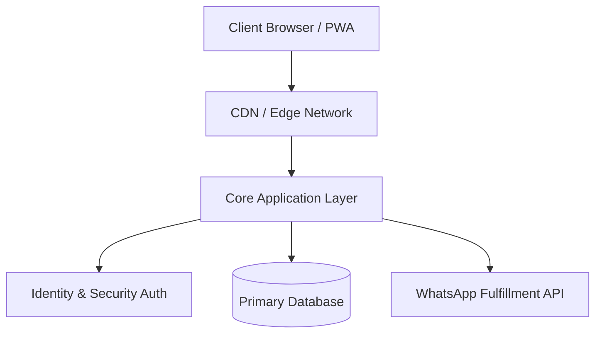

   
  <picture>
    <source media="(prefers-color-scheme: dark)" srcset="https://readme-typing-svg.demolab.com?font=Inter&weight=700&size=40&pause=1000&color=FFFFFF&center=true&vCenter=true&width=600&lines=Alixen+Apps;Enterprise+Infrastructure;Digital+Excellence">
    <source media="(prefers-color-scheme: light)" srcset="https://readme-typing-svg.demolab.com?font=Inter&weight=700&size=40&pause=1000&color=000000&center=true&vCenter=true&width=600&lines=Alixen+Apps;Enterprise+Infrastructure;Digital+Excellence">
    
  </picture>
   
  
<b>Temporarytestsheet</b> • Internal Core System

  
  

    
    
    
  

 

> **CONFIDENTIALITY NOTICE:** This repository contains proprietary source code, internal logic, and trade secrets belonging exclusively to **Alixen Apps**. Unauthorized access, reproduction, or distribution is strictly prohibited and actively monitored.

 

## 🏛️ System Architecture

This module is a critical component of the Alixen Apps digital storefront ecosystem. It handles secure subscription provisioning, regional routing, and automated fulfillment pathways.

 

## ⚡ Core Specifications

| Infrastructure Pillar | Implementation |
| :--- | :--- |
| **Frontend Runtime** | React / Next.js / Vite Optimized |
| **Styling Engine** | Tailwind CSS (Strict Design System) |
| **State Management** | Centralized Immutable Stores |
| **Data Persistence** | Edge-Compatible Cloud Databases |
| **Delivery Network** | Global CDN with Edge Caching |

 

## 🔒 Intellectual Property

Copyright © 2026 Alixen Apps / Kecrwn. All Rights Reserved.

This software and associated documentation files (the "Software") are proprietary and confidential. No part of this Software may be reproduced, distributed, or transmitted in any form or by any means, including photocopying, recording, or other electronic or mechanical methods, without the prior written permission of the owner.

 

  
   
  <b>Built by Alixen Developers</b>

